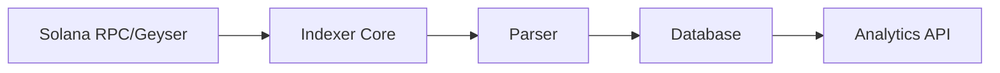

# solana-indexer-rs

A lightweight, performance-focused Solana indexer written in Rust for real-time transaction analytics.

## Features

- **Real-time Analytics**: High-performance transaction processing for live Solana data.
- **Efficient Storage**: Optimized data structures for indexing and querying.
- **Rust-powered**: Leveraging Rust's safety and performance for blockchain backend infra.
- **Customizable Schemas**: Flexible indexing logic to target specific programs or accounts.

## Architecture

The indexer connects to a Solana RPC node (or GEISER plugin) to receive transaction updates, parses them based on predefined instructions, and persists the extracted data into a high-performance database.



## Prerequisites

- [Rust](https://www.rust-lang.org/tools/install) (latest stable)
- [Solana CLI](https://docs.solanalabs.com/cli/install) (for testing/keys)
- A Solana RPC Provider (e.g., Helius, Triton, or self-hosted)

##  Getting Started

### 1. Clone the repository
```bash
git clone https://github.com/Cherrypick14/solana-indexer-rs.git
cd solana-indexer-rs
```

### 2. Configure Environment
Create a `.env` file based on the example:
```bash
cp .env.example .env
# Edit .env with your RPC URL and database credentials
```

### 3. Build and Run
```bash
cargo build --release
./target/release/solana-indexer-rs
```

## REST API

The indexer now includes a built-in REST API powered by Axum, enabling you to query indexed transaction data. The API server runs concurrently with the indexer.

### Configuration
Update your `.env` to configure the API server:
```env
API_BIND_ADDRESS=0.0.0.0
API_PORT=8080
```

### Endpoints

#### 1. Fetch Transaction by Signature
Returns the details of a specific transaction including parsed instructions and accounts.

```bash
curl http://localhost:8080/transactions/5VfydDNssM4QFXwJjnM6DnFn7V1tJxn3TynHz9qu7LrdH8hsZ1WLKMtFtVscky5E4UFs6j5HE5F2WGH4mzYe2hKt
```

#### 2. Query Transactions
Returns a paginated list of transactions filtered by query parameters.

**Query Parameters:**
- `account`: Filter by a specific account public key
- `program_id`: Filter by a specific program ID
- `start_slot`: Filter transactions starting from this slot (inclusive)
- `end_slot`: Filter transactions up to this slot (inclusive)
- `page`: Page number for pagination (default: 1)
- `limit`: Number of results per page (default: 20, max: 100)

**Example: Fetch transactions for an account**
```bash
curl "http://localhost:8080/transactions?account=11111111111111111111111111111112&page=1&limit=10"
```

**Example: Fetch transactions by slot range**
```bash
curl "http://localhost:8080/transactions?start_slot=150000000&end_slot=150000100"
```

## Roadmap

- [ ] Core indexing engine implementation
- [ ] Support for popular program IDL parsing
- [ ] WebSocket integration for live updates
- [ ] Multi-database backend support (PostgreSQL, ClickHouse)

## License

Distributed under the MIT License. See `LICENSE` for more information.
