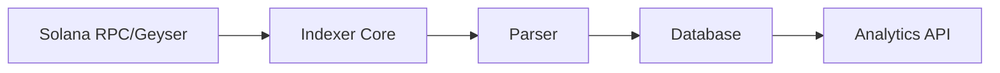

# solana-indexer-rs

A lightweight, performance-focused Solana indexer written in Rust for real-time transaction analytics.

## Features

- **Real-time Analytics**: High-performance transaction processing for live Solana data.
- **Efficient Storage**: Optimized data structures for indexing and querying.
- **Rust-powered**: Leveraging Rust's safety and performance for blockchain backend infra.
- **Customizable Schemas**: Flexible indexing logic to target specific programs or accounts.

## Architecture

The indexer connects to a Solana RPC node (or GEISER plugin) to receive transaction updates, parses them based on predefined instructions, and persists the extracted data into a high-performance database.



## Prerequisites

- [Rust](https://www.rust-lang.org/tools/install) (latest stable)
- [Solana CLI](https://docs.solanalabs.com/cli/install) (for testing/keys)
- A Solana RPC Provider (e.g., Helius, Triton, or self-hosted)

##  Getting Started

### 1. Clone the repository
```bash
git clone https://github.com/Cherrypick14/solana-indexer-rs.git
cd solana-indexer-rs
```

### 2. Configure Environment
Create a `.env` file based on the example:
```bash
cp .env.example .env
# Edit .env with your RPC URL and database credentials
```

### 3. Build and Run
```bash
cargo build --release
./target/release/solana-indexer-rs
```

## Roadmap

- [ ] Core indexing engine implementation
- [ ] Support for popular program IDL parsing
- [ ] WebSocket integration for live updates
- [ ] Multi-database backend support (PostgreSQL, ClickHouse)

## License

Distributed under the MIT License. See `LICENSE` for more information.
